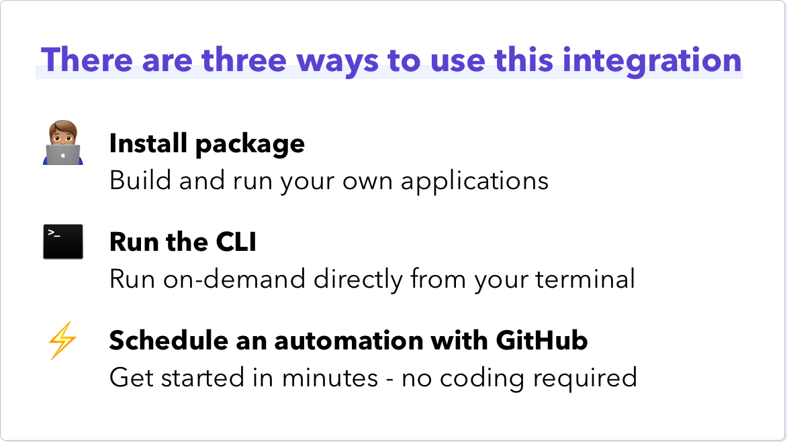

> **Warning**
> This repository is no longer recommended or maintained and has been archived in Github. Huge thanks to the original authors and contributors for providing this Github Actions template to our community. To add Reddit interactions to your Orbit workspace, you can now request access to the Reddit integration under `Workspace Settings > Integrations`. Should you wish to maintain your own version of this repository, you are welcome to fork this repository and continue developing it there.

---


[](https://badge.fury.io/js/%40orbit-love%2Freddit)
[](.github/CODE_OF_CONDUCT.md)

This is a JavaScript package that can be used to integrate new Reddit interactions from a specified subreddit into your organization's Orbit workspace.


| <p align="left">:sparkles:</p> This is a _community project_. The Orbit team does its best to maintain it and keep it up to date with any recent API changes.<br/><br/>We welcome community contributions to make sure that it stays current. <p align="right">:sparkles:</p> |
| ----------------------------------------------------------------------------------------------------------------------------------------------------------------------------------------------------------------------------------------------------------------------------- |



## First Time Setup

1. Head to your [Reddit App Preferences](https://www.reddit.com/prefs/apps/).
2. Create a new app with the following settings:
   1. Name: `orbit-community-integration`
   2. Type: `script`
   3. Description: `orbit.love community integration`
   4. About URL: `https://github.com/orbit-love/community-js-reddit-orbit`
   5. Redirect URI: `https://orbit.love`
3. Take note of your `Client ID` which is just below your app name, and your `Client Secret`.

## Application Credentials

The application requires the following environment variables:

| Variable               | Description                       | More Info                                                                                                  |
| ---------------------- | --------------------------------- | ---------------------------------------------------------------------------------------------------------- |
| `REDDIT_CLIENT_ID`     | Client ID for your Reddit App     | Follow the guide above                                                                                     |
| `REDDIT_CLIENT_SECRET` | Client Secret for your Reddit App | Follow the guide above                                                                                     |
| `REDDIT_USERNAME`      | Your Reddit username\*            | Your account credentials                                                                                   |
| `REDDIT_PASSWORD`      | Your Reddit password              | Your account credentials                                                                                   |
| `ORBIT_API_KEY`        | API key for Orbit                 | Found in `Account Settings` in your Orbit workspace                                                        |
| `ORBIT_WORKSPACE_ID`   | ID for your Orbit workspace       | Last part of the Orbit workspace URL, i.e. `https://app.orbit.love/my-workspace`, the ID is `my-workspace` |

### Username cannot have 2FA
\**PLEASE NOTE: For this to work, your Reddit account should have 2FA disabled AND needs to have a password set.

- If you used your Google or Apple account to sign up to Reddit and don't have an account, you could disconnect it, and then you'll be able to set an account (and reconnect your Google or Apple account after).
- If you want 2FA enabled on your main Reddit account (you probably should): create an additional account to set up this integration and don't use your main account.

## Package Usage

Install the package with the following command

```
$ npm install @orbit-love/reddit
```

The standard initialization of the library requires the following signature:

```js
const OrbitReddit = require("@orbit-love/reddit");
const orbitReddit = new OrbitReddit(
  "orbitWorkspaceId",
  "orbitApiKey",
  "redditClientId",
  "redditClientSecret",
  "redditUsername",
  "redditPassword"
);
```

If you have the following environment variables set: `ORBIT_WORKSPACE_ID`, `ORBIT_API_KEY`, `REDDIT_CLIENT_ID`, `REDDIT_CLIENT_SECRET`, `REDDIT_USERNAME` and `REDDIT_PASSWORD` then you can initialize the client as follows:

```js
const OrbitReddit = require("@orbit-love/reddit");
const orbitReddit = new OrbitReddit();
```

### Add New Posts In Subreddit

```js
const OrbitReddit = require("@orbit-love/reddit");
const orbitReddit = new OrbitReddit();

// Allows you to go back a number of hours and only get posts in that timeframe
const posts = await orbitReddit.getPosts({ subreddit: "javascript", hours: 24 });
const prepared = await orbitReddit.preparePosts(posts);
const summary = await orbitReddit.addActivities(prepared);
console.log(summary);
```

### Add New Comments In Subreddit

```js
const OrbitReddit = require("@orbit-love/reddit");
const orbitReddit = new OrbitReddit();

// Allows you to go back a number of hours and only get posts in that timeframe
const comments = await orbitReddit.getComments({ subreddit: "javascript", hours: 24 });
const prepared = await orbitReddit.prepareComments(comments);
const summary = await orbitReddit.addActivities(prepared);
console.log(summary);
```

## CLI Usage

To use this package you do not need to install it, but will need Node.js installed on your machine.

```
npx @orbit-love/reddit --posts --subreddit=javascript
npx @orbit-love/reddit --comments --subreddit=javascript
```

### Timeframe

By default this will get the last 24 hours worth of activity, but this can be explicitly overridden:

```
npx @orbit-love/reddit --posts --subreddit=javascript --hours=12
```

### Filtering

You can pass in a `--filter=term` flag to filter the results by a single term.

- For posts this will match if the post title, url or body text contain the term.
- For comments this will match if it was left on a post with a title containing the term, or the comment itself contains the term.

### Performing a Historical Import

You may want to perform a one-time historical import to fetch all your previous Reddit interactions and bring them into your Orbit workspace. To do so, set the hours tag to 720 for 30 days of import.

## GitHub Actions Automation Setup

⚡ You can set up this integration in a matter of minutes using our GitHub Actions template. It will run regularly to add new activities to your Orbit workspace. All you need is a GitHub account.

[See our guide for setting up this automation](https://github.com/orbit-love/github-actions-templates/blob/main/Reddit)

## Contributing

We 💜 contributions from everyone! Check out the [Contributing Guidelines](.github/CONTRIBUTING.md) for more information.

## License

This project is under the [MIT License](./LICENSE).

## Code of Conduct

This project uses the [Contributor Code of Conduct](.github/CODE_OF_CONDUCT.md). We ask everyone to please adhere by its guidelines.
